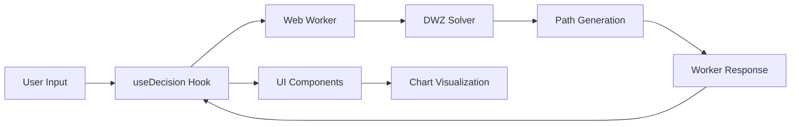

# Architecture - DWZ v2

## Overview

The DWZ v2 calculator uses a monorepo architecture with separated concerns:

- **Math Engine**: Pure TypeScript calculations in `packages/dwz-core`
- **UI Layer**: React application in `apps/dwz-v2`
- **Workspace Management**: npm workspaces for dependency management

## Directory Structure

```
aussie-fire/
├── packages/
│   └── dwz-core/              # Math engine package
│       ├── src/
│       │   ├── solver.ts      # Core DWZ algorithm
│       │   ├── types.ts       # Type definitions
│       │   └── index.ts       # Public API
│       └── tests/             # Unit tests
├── apps/
│   └── dwz-v2/               # React application
│       ├── src/
│       │   ├── worker.ts     # Web Worker for calculations
│       │   ├── lib/          # React hooks
│       │   └── components/   # UI components
└── tsconfig.base.json        # Shared TypeScript config
```

## Core Components

### DWZ Solver (`packages/dwz-core`)

**Purpose**: Pure mathematical engine that solves the Die-With-Zero optimization problem.

**Key Functions**:
- `findEarliestViable(inputs)`: Main entry point, returns earliest retirement age with full path
- `solveSBaseForAge(inputs, age)`: Bisection search to find spending that depletes to bequest target
- `computeBridgePV(inputs, age, sBase)`: Present value calculation for bridge period funding

**Algorithm**:
1. **Accumulation Phase**: Model pre-retirement wealth growth with annual savings
2. **Viability Check**: For each candidate retirement age, verify bridge can be funded
3. **Spend-Down Simulation**: Use solved S_base to project post-retirement depletion
4. **Path Generation**: Create continuous end-of-year FV points for visualization

### Web Worker (`apps/dwz-v2/src/worker.ts`)

**Purpose**: Offload calculations to prevent UI blocking during intensive computations.

**Data Flow**:
```
UI Input → Worker Message → DWZ Solver → Worker Response → UI Update
```

**Benefits**:
- Non-blocking calculations
- Consistent performance regardless of complexity
- Easy to abort/restart on input changes

### React Application (`apps/dwz-v2`)

**Architecture**:
- **Hooks**: `useDecision` manages worker communication and state
- **Components**: Pure presentation layer consuming solved data
- **Charts**: Recharts for lifecycle visualization with phase styling

## Data Flow



## Key Design Decisions

### End-of-Year Convention
All path points represent balances at **end of year** to ensure continuity across accumulation and retirement phases.

### Present Value Bridge Calculations
Bridge viability uses PV of spending stream discounted at the same rate as invested outside funds, ensuring mathematical consistency.

### Couples-First Design
- Combined household balances
- Minimum preservation age between partners
- Single optimization target (household sustainable spending)

### TypeScript Throughout
- Compile-time safety for financial calculations
- Clear interfaces between math engine and UI
- Enhanced development experience with autocomplete

## Testing Strategy

### Unit Tests (`packages/dwz-core/tests/`)
- Solver convergence (terminal wealth ≈ bequest target)
- Path continuity (no discontinuities at retirement boundary)
- Bridge calculation accuracy
- Scale invariance testing

### Integration Testing
- Worker message passing
- UI state management
- Chart data consistency

## Performance Considerations

### Calculation Complexity
- Bisection search: O(log n) iterations for S_base
- Linear search: O(n) for earliest viable age
- Path generation: O(years) for full lifecycle

### Optimization Opportunities
- Binary search for earliest viable age (future enhancement)
- Memoization for repeated calculations
- WebAssembly for intensive computations (if needed)

## Extension Points

### T-R2: Savings Split Optimizer
The current architecture supports extending the solver with:
- Concessional cap constraints
- Tax-aware contribution optimization
- Per-person recommendation generation

### T-R3: Advanced Features
- Multi-scenario analysis
- Monte Carlo simulation
- Advanced couples handling

The modular design allows these features to be added without disrupting the core DWZ engine.